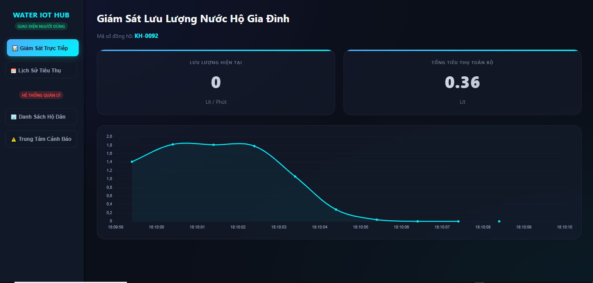
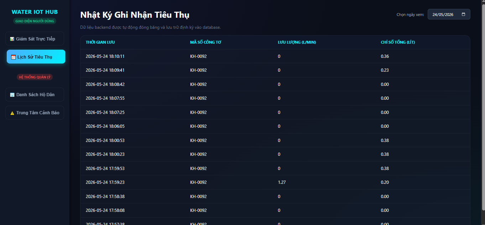
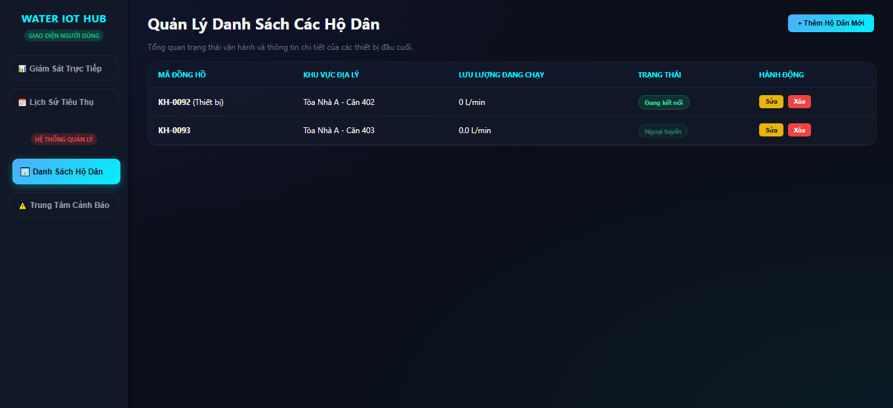
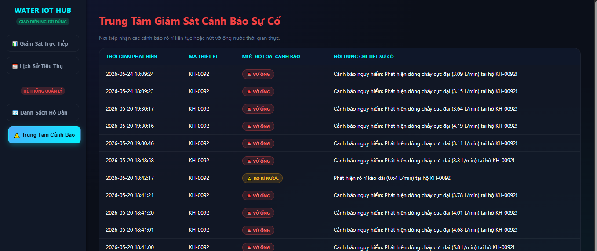
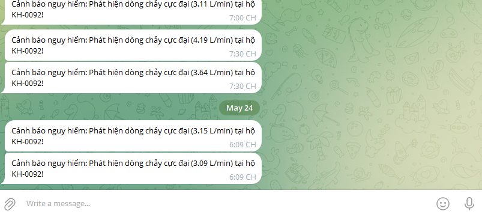

<h2 align="center">
    <a href="https://dainam.edu.vn/vi/khoa-cong-nghe-thong-tin">
    🎓 Faculty of Information Technology (DaiNam University)
    </a>
</h2>
<h2 align="center">
   HỆ THỐNG GIÁM SÁT ĐỒNG HỒ NƯỚC THÔNG MINH 
</h2>

<div align="center">
    <p align="center">
        
    </p>

[](https://www.facebook.com/DNUAIoTLab)
[](https://dainam.edu.vn/vi/khoa-cong-nghe-thong-tin)
[](https://dainam.edu.vn)

</div>

---

## 1. 📌 Giới thiệu

**Smart Water IoT Dashboard** là hệ thống quản lý, theo dõi chỉ số tiêu thụ nước thời gian thực ứng dụng công nghệ IoT. Dự án kết hợp phần cứng thu thập dữ liệu (qua giao tiếp Serial) và một Web Dashboard trực quan giúp người dùng dễ dàng giám sát lượng nước tiêu thụ, quản lý hóa đơn và nhận cảnh báo rò rỉ tức thời.

Hệ thống cho phép:
- 📊 **Giám sát trực quan:** Theo dõi lưu lượng nước tiêu thụ thời gian thực (Real-time) qua biểu đồ.
- ⚙️ **Kết nối bền bỉ:** Cơ chế *Serial Auto-Reconnect* tự động phát hiện và kết nối lại với phần cứng khi bị ngắt quãng.
- 💾 **Lưu trữ dữ liệu:** Tự động đồng bộ và lưu lịch sử chỉ số nước vào cơ sở dữ liệu SQLite.
- 📢 **Cảnh báo thông minh:** Tự động gửi thông tin tiêu thụ, báo cáo hóa đơn hoặc cảnh báo rò rỉ về ứng dụng Telegram của người dùng.

---

## 2. 🎯 Mục tiêu đề tài

- Nghiên cứu và xây dựng mô hình thu thập dữ liệu từ cảm biến lưu lượng nước (Flow Sensor).
- Thiết kế hệ thống xử lý bất đồng bộ (Multi-threading) dưới nền để đảm bảo việc đọc cổng Serial liên tục không làm nghẽn giao diện Web.
- Tối ưu hóa cơ sở dữ liệu để lưu trữ tài nguyên tiêu thụ theo ngày/tháng/năm, phục vụ tính toán hóa đơn tự động.
- Xây dựng hệ thống cảnh báo từ xa giúp phát hiện bất thường (áp lực nước giảm, dòng chảy liên tục nghi rò rỉ).

---

## 3. 📂 Cấu trúc cơ sở dữ liệu & Quản lý luồng (Architecture)

Hệ thống sử dụng cơ sở dữ liệu SQLite local để quản lý thông tin hoạt động:
- **Dữ liệu tiêu thụ (Water Metrics):** Lưu trữ lượng nước (lít/khối), thời gian ghi nhận chi tiết đến từng giây.
- **Cấu hình hệ thống (Settings):** Lưu trữ các ngưỡng cảnh báo rò rỉ, đơn giá tiền nước để tính toán hóa đơn trực tiếp.
- **Luồng xử lý nền (Background Thread):** Một tiến trình chạy song song với ứng dụng Flask chịu trách nhiệm quét, đọc dữ liệu raw từ cổng COM/Serial và đẩy vào DB.

---

## 4. ⚙️ Hướng triển khai

### 🔹 Bước 1: Lập trình phần cứng (Firmware)
- Viết code cho vi điều khiển (Arduino/ESP32) để đọc xung từ cảm biến lưu lượng nước.
- Đóng gói dữ liệu thành dạng chuỗi chuẩn (ví dụ: JSON hoặc chuỗi phân tách) và gửi lên máy tính qua cổng USB (Serial).

### 🔹 Bước 2: Xây dựng Backend với Flask
- Thiết lập Server Flask để làm ứng dụng cốt lõi điều hướng dữ liệu.
- Viết module kết nối Serial có hàm kiểm tra lỗi (Try-Except) và vòng lặp tự động kết nối lại (`time.sleep` nối lại sau vài giây nếu mất kết nối).

### 🔹 Bước 3: Thiết kế Front-end Dashboard
- Thiết kế giao diện Dashboard theo dõi bằng HTML5, CSS3 và Bootstrap.
- Sử dụng thư viện JavaScript (như Chart.js hoặc ApexCharts) kết hợp Fetch API/AJAX để cập nhật biểu đồ liên tục mà không cần tải lại trang.

### 🔹 Bước 4: Tích hợp Telegram Bot API
- Khởi tạo Bot qua @BotFather để lấy Token.
- Viết hàm gửi HTTP Request trong Python để đẩy tin nhắn thông báo tự động khi phát hiện lượng nước tăng đột biến hoặc định kỳ cuối tháng.

---

## 5. 🔥 Tính năng chính

✔ **Giao diện Real-time:** Dashboard cập nhật số khối nước và số tiền theo thời gian thực.  
✔ **Tự động phục hồi kết nối:** Cơ chế chống sập luồng khi rút/cắm lại dây cáp Serial thiết bị IoT.  
✔ **Quản lý hóa đơn trực quan:** Tự động tính toán số tiền nước dựa trên bậc thang biểu giá quy định.  
✔ **Hệ thống cảnh báo an toàn:** Gửi tin nhắn khẩn cấp qua Telegram nếu phát hiện dòng nước chảy liên tục không ngắt (nghi ngờ quên khóa vòi hoặc vỡ đường ống).  
✔ **Lưu trữ bảo mật:** Tách biệt token cấu hình an toàn bằng file môi trường, chặn đẩy file cơ sở dữ liệu dư thừa lên GitHub.

---

## 6. 🖥️ Giao diện hệ thống

<div align="center">
    
    <p><i>Màn hình bảng điều khiển tổng quan (Dashboard) chỉ số nước</i></p>
</div>

<div align="center">
    
    <p><i>Biểu đồ phân tích lưu lượng nước tiêu thụ theo thời gian</i></p>
</div>

<div align="center">
    
    <p><i>Trang cấu hình ngưỡng cảnh báo và đơn giá nước</i></p>
</div>

<div align="center">
    
    <p><i>Giao diện quản lý lịch sử và kết xuất hóa đơn</i></p>
</div>

<div align="center">
    
    <p><i>Thông báo chỉ số nước và cảnh báo rò rỉ qua Telegram</i></p>
</div>

---

## 7. 🧠 Công nghệ sử dụng

[](https://www.python.org/)
[](https://flask.palletsprojects.com/)
[](https://sqlite.org/)
[](https://developer.mozilla.org/en-US/docs/Web/HTML)
[](https://getbootstrap.com/)

---

## 8. ⚡ Cài đặt & Chạy dự án

### Clone project
Mở terminal và sao chép mã nguồn về máy cục bộ:
```bash
git clone [https://github.com/MinnKaa/TPTM_NNTM.git]
